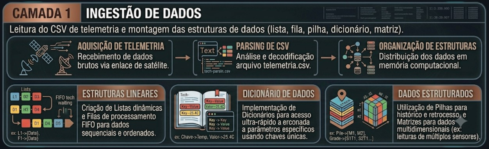
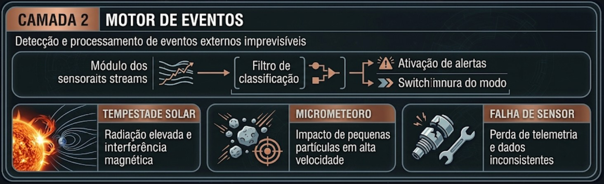
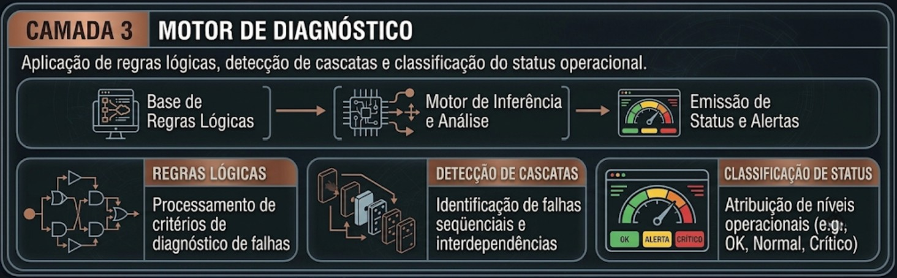
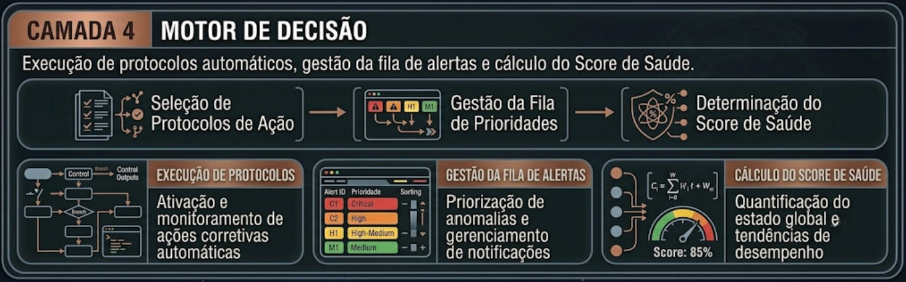
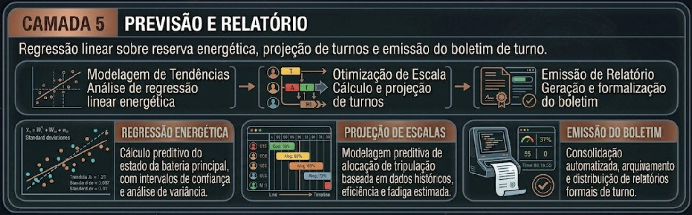

# 🚀 Aurora Prime Control System (APCS)


> **Global Solution — FIAP 2026**

A Missão Aurora Prime representa o estágio mais avançado da presença humana em Marte. Operando sob condições extremas, a colônia depende do **Aurora Prime Control System (APCS)** — um sistema inteligente, defensivo e totalmente autônomo, projetado para gerenciar recursos, prever falhas e tomar decisões vitais durante atrasos de comunicação de até 24 minutos com a Terra.

---

## 👨‍🚀 Equipe Aurora Prime (1CCOA-2026)
| Nome | RM |
| :--- | :--- |
| **Flávia Roberta Pennachin** | RM561860 |
| **Juan de Lucas Frois** | RM563260 |
| **Pedro Valente Toledo** | RM570394 |

---
## 🎯 Cenário Analisado

O sistema desenvolvido neste projeto, denominado Aurora Prime Control System APCS, é o núcleo operacional da colônia. Ele recebe dados de telemetria em ciclos de turno 08h, 12h, 16h, 20h, 00h e 04h), interpreta o estado de seis módulos críticos, detecta anomalias, diagnostica falhas em cascata, executa protocolos automáticos de decisão e projeta o comportamento futuro da reserva energética por meio de regressão linear. Tudo isso sem aguardar instrução humana.

O sistema foi projetado para ser testado em quatro cenários distintos, que estão embutidos no arquivo de telemetria:

* **Cenário 1:** Todos os módulos operacionais, reserva de energia acima de 70%. O sistema confirma estabilidade, calcula um Score de Saúde alto e executa regressão linear positiva.

* **Cenário 2:** Uma tempestade de areia inicia uma cadeia de eventos. A geração solar cai, pressionando a reserva de energia. O laboratório é desligado automaticamente; em seguida, a comunicação entra em modo emergência e o suporte à vida vira prioridade máxima. O Score despenca progressivamente.

 * **Cenário 3:** Uma tempestade solar força a colônia a entrar em modo de blindagem, operando em modo autônomo. Um micrometeoro causa falha em um sensor, testando o Protocolo de Votação de Sensores, que substitui o dado corrompido por uma média válida.

* **Cenário 4:** Estabilização após a crise, dividida em Sobrevivência Mínima (apenas suporte à vida), Estabilização (reativação de habitat) e Retorno Normal Score acima de 70 pontos, autorizando o religamento do laboratório).

---

## 🏗️ Arquitetura do Sistema (As 5 Camadas APCS)
O código-fonte (`sistema.py`) foi desenvolvido com base em Engenharia de Software robusta, dividido em 5 motores lógicos que processam 56 Sóis marcianos (336 turnos) de forma autônoma:
<br>
<br>

  
  Utiliza `Pandas` envolto num bloco `try/except` para ler a telemetria, aspirar espaços em branco (Data Cleansing) e evitar quebras críticas caso o sensor de dados fique offline.
<br>
<br>

   
   Avalia intempéries (Tempestades Solares, Micrometeoros). Possui um sistema de **Votação de Sensores** que, ao detectar dados corrompidos (ex: `-999°C`), calcula a média histórica para evitar alarmes falsos.
<br>
<br>

  
  Avalia a árvore de sistemas em tempo real (Energia, Habitação, Medicina). Cruza variáveis para detectar o temido "Efeito Cascata" (quando a falha de um módulo compromete a sobrevivência).
<br>
<br>

  
  Aplica Regressão Linear Simples (`np.polyfit`) sobre as leituras recentes das baterias para prever matematicamente o colapso. Gera o **Score de Saúde (0-100%)**, ponderando energia, integridade dos módulos e clima.
<br>
<br>

  
  Formula um plano de ação diário (desligar módulos, distribuir kits médicos). Gerencia o protocolo **DTN (Delay-Tolerant Networking)**, calculando o *Time of Flight* da luz para enviar mensagens à Terra via Laser ou Rádio.

---

## 🎲 Estruturas de Dados Aplicadas
Para garantir a eficiência computacional exigida por um sistema de tempo real crítico, a arquitetura de dados em memória foi rigorosamente planejada:

* **Listas (Histórico Temporal):** Utilizadas para armazenar a série histórica de variáveis como a reserva de baterias (`historico_baterias`) e geração solar, essenciais para alimentar os algoritmos de modelagem preditiva.
* **Filas / FIFO (Gestão de Alertas e DTN):** Aplicadas na `fila_alertas` para processamento sequencial e na simulação do protocolo espacial *Delay-Tolerant Networking* (`fila_transmissao_terra`). Quando a janela de comunicação com a Terra fecha, os pacotes são enfileirados e, ao reabrir, transmitidos na exata ordem cronológica.
* **Pilhas / LIFO (Eventos Críticos):** A `pilha_eventos_criticos` atua como o diário de bordo dinâmico do sistema. O evento adverso mais recente fica no topo da pilha, garantindo que o operador recupere a ocorrência mais urgente em tempo $O(1)$.
* **Dicionários e Tabelas Hash (Hierarquia e Status):** O mapeamento completo dos módulos e subsistemas foi estruturado em dicionários (`hierarquia_sistemas_colonia`). Isso permite que o Motor de Diagnóstico e o terminal interativo realizem buscas diretas pelo estado de qualquer componente vital com complexidade de tempo constante $O(1)$.
* **Matrizes (Telemetria 2D):** A estrutura `matriz_horarios` organiza os dados brutos como uma grade dimensional (linhas para turnos, colunas para sensores), facilitando a varredura e a auditoria da integridade dos dados operacionais.

---

## 🧠 Lógica de Diagnóstico Principal
O cérebro do diagnóstico utiliza portas lógicas estritas (`IF/ELIF/ELSE` + `AND/OR/NOT`). A expressão booleana crítica que dita a "Emergência Máxima" (Protocolo Omega) é:

* **Prioridade Absoluta (NOT):** Funções estritamente vitais, como a geração de oxigênio, não possuem tolerância. A expressão determina que, se não houver operação do suporte principal ('not oxigenio == 1'), o status do módulo inteiro é imediatamente rebaixado para crítico, ignorando outras variáveis atenuantes, como reservas provisórias de água.
* **Tolerância a Degradação Parcial (AND):** Sistemas redundantes foram tratados com flexibilidade lógica. A comunicação, por exemplo, dispõe de links via rádio e laser. A regra define que a comunicação só é classificada como "normal" se ambos os canais estiverem operando acima de 50%. Se ambos caírem para a faixa dos 20%, o sistema emite um "alerta". A falha total é decretada caso fiquem abaixo desse limiar.
* **Identificação de Cascata:** O sistema implementa uma função específica para cruzar os diagnósticos e identificar interdependências fatais. Se o diagnóstico relatar energia crítica e, simultaneamente, falha no módulo habitacional, o APCS infere logicamente que a falta de energia derrubou o sistema de climatização, ativando imediatamente o Protocolo Omega (redirecionamento exclusivo de energia para suporte à vida).


```text
SE (energia_armazenada < 20) E (oxigenio == 0 OU reserva_agua < 40) ENTÃO
    STATUS = "CASCATA: Falha no suporte à vida por colapso energético."
    AÇÃO = "Redirecionar toda a energia restante para Suporte à Vida."

```

---


## 📈 Técnica de Previsão por Regressão Linear
Para além de reagir a problemas atuais, o sistema precisava de inteligência preditiva para evitar o colapso energético. Implementamos um algoritmo de regressão linear simples operando sobre os dados brutos de reserva das baterias, utilizando a biblioteca NumPy (np.polyfit).

A técnica recolhe as leituras mais recentes da lista temporal de energia (eixo Y) em função dos turnos passados (eixo X) e ajusta uma reta pelo método dos mínimos quadrados. A partir dos coeficientes obtidos, o sistema projeta o comportamento futuro baseando-se na equação fundamental da reta:
```text
                        y = mx + b
```
Se a inclinação da reta (m) for negativa, o algoritmo calcula matematicamente o ponto de intersecção onde o eixo Y (energia) atinge zero. Esse valor de turnos restantes é então convertido para Sóis Marcianos, permitindo que o sistema gere um alerta preditivo extremamente preciso: "Mantendo-se a queda atual, as baterias esgotarão em X Sóis". Esta extrapolação transforma dados passivos em recomendações ativas vitais.


---

## 💻 Como Executar a Simulação

O sistema não exige interfaces gráficas pesadas, operando diretamente no terminal com alta performance.

1. Instale as dependências analíticas:

```bash
pip install pandas numpy

```

2. Execute o núcleo do APCS:

```bash
python src/sistema.py

```

> 💡 *Nota:* Ao término dos 56 Sóis, o sistema exportará uma planilha de auditoria para `docs/relatorio_execucao_aurora.csv` e abrirá o Menu Interativo O(1).

---

## 📡 Exemplo de Saída no Terminal (Log de Comunicação)

Durante a tempestade de poeira marciana, o sistema apresenta a seguinte clareza operacional:

```text
» RELATÓRIO DE FECHO - SOL 32 | Turno: 187 | Cenário: 3
  SAÚDE DA MISSÃO: 🔴 [CRÍTICO] [█-------------------] 5%
  [!] Janela Fechada (MODO AUTÔNOMO).
  Baterias: 11.0%
  Eventos do Dia: Tempestade solar em curso. Radiação elevada.
  🚨 [PREVISÃO CRÍTICA] Mantendo-se a queda atual, as baterias esgotarão em 1.5 Sóis.
  [PLANO DE AÇÃO DIÁRIO]:
    -> Protocolo Economia: Desligar Laboratório e hibernar aquecimento secundário.
    -> Isolamento Tático: Manter operações 100% autônomas.
  - - - - - - - - - - - - - - - - - - - - - - - - - - - - - -
  [!] TRANSMISSÃO RETIDA: Janela fechada. Pacote guardado na fila (Pendentes: 3).
=====================================================================================

```

---

## 🎥 Pitch e Demonstração

▶️ **[[Pitch do Projeto](https://www.youtube.com/watch?v=_Ahucx3Avps)]**

---

## 🎯 Conclusões e Aprendizagens

A construção do APCS elevou o desafio acadêmico para o nível de arquitetura de software real. Compreendemos que a inteligência de um sistema não está apenas no seu código final, mas em como ele se **defende** de falhas (usando tratamento de exceções no Pandas) e como lida com as **leis da física** (incorporando os atrasos da velocidade da luz na nossa Fila FIFO de rede).

A utilização da Regressão Linear com NumPy superou as expectativas de análise simples, criando um sistema verdadeiramente preditivo. As estruturas de dados deixaram de ser conceitos teóricos e tornaram-se a fundação absoluta para manter uma colônia virtual viva em Marte.
